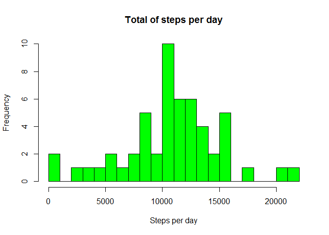
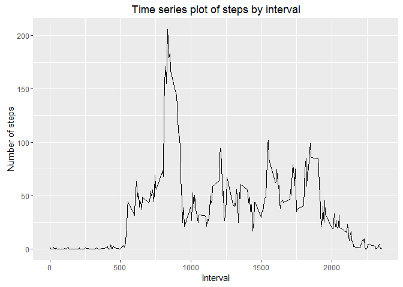
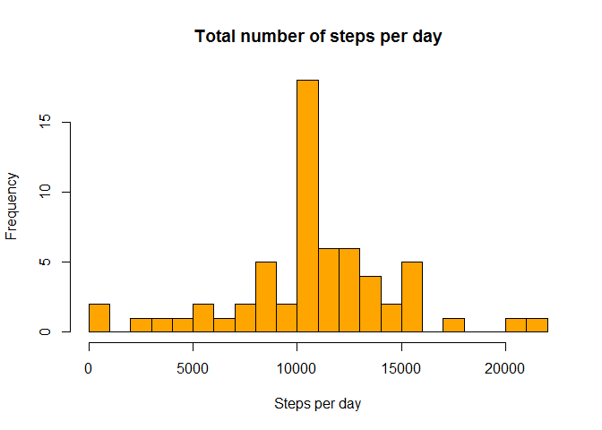
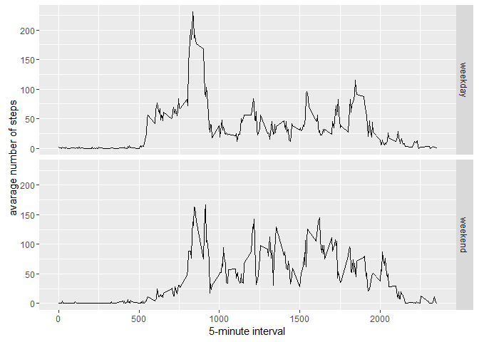

Reproducible Research: Peer Assessment 1
========================================

Loading and preprocessing the data
----------------------------------

Codes to load and preprocess the data:

    directory <- ("activity")
    file <- ("activity.csv")
    activity <- read.csv(file.path(directory, file))
    activity_na_omit <- na.omit(activity)
    total_ac_na_omit <- aggregate(steps ~ date, activity_na_omit, sum)

What is mean total number of steps taken per day?
-------------------------------------------------

Code to make a histogram of the total number of steps taken each day:

    hist(
            total_ac_na_omit$steps, 
            main = "Total of steps per day", 
            xlab="Steps per day", 
            ylab="Frequency", 
            col = "green", 
            breaks = 20
            )

Codes to calculate the mean and median total number of steps taken per
day:

    steps_mean <- mean(total_ac_na_omit$steps)
    steps_median <- median(total_ac_na_omit$steps)
    print(steps_mean)

    ## [1] 10766.19

    print(steps_median)

    ## [1] 10765

What is the average daily activity pattern?
-------------------------------------------

Code to preprocess the data:

    total_ac_average <- aggregate(steps ~ interval, activity_na_omit, mean)

Code to create a time series plot:

    library(ggplot2)
    par(mar = c(1.5, 1.5, 1, 1))
    ggplot(total_ac_average, aes(interval, steps)) +
            geom_line() +
            ggtitle("Time series plot of steps by interval") +
            xlab("Interval") +
            ylab("Number of steps")

Code to calculate the maximum number of steps:

    max_number_steps <- which.max(total_ac_average$steps)
    print(total_ac_average[max_number_steps,])

    ##     interval    steps
    ## 104      835 206.1698

Imputing missing values.
------------------------

Code to calculate the total number of missing values in the dataset:

    number_na <- sum(is.na(activity$steps))
    print(number_na)

    ## [1] 2304

Code to fill in all of the missing values in the dataset:

    fill_na <- function(steps, interval) {
            fill_ac <- NA
            if (!is.na(steps))
                    fill_ac <- c(steps)
            else
                    fill_ac <- (total_ac_average[total_ac_average$interval==interval, "steps"])
            return(fill_ac)
    }

Codes to create a new dataset with the missing data filled in:

    new_activity <- activity
    new_activity$steps <- mapply(fill_na, new_activity$steps, new_activity$interval)

Codes to make a histogram of the total number of steps taken each day
and to calculate the mean and median total number of steps taken per
day:

    total_ac_steps <- aggregate(steps ~ date, new_activity, sum)
    hist(
            total_ac_steps$steps, 
            main = "Total number of steps per day", 
            xlab="Steps per day", 
            ylab="Frequency", 
            col = "orange", 
            breaks = 20
    )

    total_ac_steps_mean <- mean(total_ac_steps$steps) 
    total_ac_steps_median <- median(total_ac_steps$steps) 
    print(total_ac_steps_mean)

    ## [1] 10766.19

    print(total_ac_steps_median)

    ## [1] 10766.19

### Do these values differ from the estimates from the first part of the assignment?

They do differ, although slightly. The mean concerning the total number
of steps taken per day - considering the missing values - is 10766.19,
while the mean with all the NA filled in by the mean is also 10766.19.
But the median is a bit different. While the median - considering the
missing values - is 10765, the median with the NA filled in by the mean
is 10766.19.

### What is the impact of imputing missing data on the estimates of the total daily number of steps?

If we consider the mean, there was no impact at all, since I opted to
use the mean itself to fill in all the NA. Although there was a
difference at the medians, it was by 1.19. It seems to have no great
impact.

Are there differences in activity patterns between weekdays and weekends?
-------------------------------------------------------------------------

Codes to create the new factor variable in the dataset with the levels
"weekday" and "weekend":

    week_activity <- new_activity

    week_activity$date <- as.Date(strptime(week_activity$date, format="%Y-%m-%d")) 

    week_activity$day <-  factor(ifelse(as.POSIXlt(week_activity$date)$wday %in% c(0,6), 'weekend', 'weekday'))

Code to calculate the averaged number of steps taken by "weekday"" or
"weekend":

    averaged_week_activity <- aggregate(steps ~ interval + day, data=week_activity, mean)

Code to plot a time series of the 5-minute interval (x-axis) and the
average number of steps taken, averaged across all weekday days or
weekend days (y-axis):

    library(ggplot2)
    ggplot(averaged_week_activity, aes(interval, steps)) + 
            geom_line() + 
            facet_grid(day ~ .) +
            xlab("5-minute interval") + 
            ylab("avarage number of steps")

